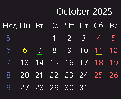
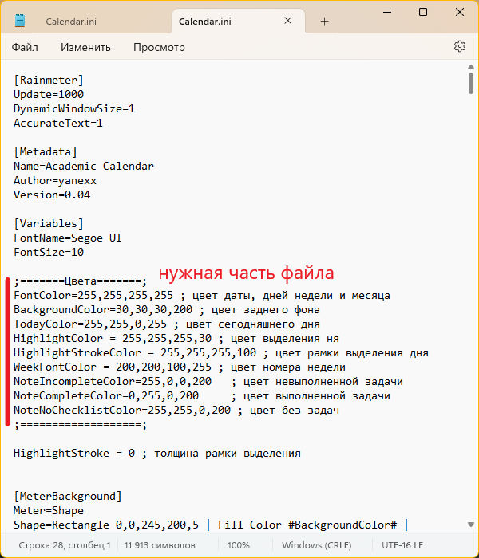

# Календарь для Rainmeter

  

Простой календарь для Rainmeter с поддержкой учебных недель и интеграцией с Obsidian.

---

## Особенности
 
- Автоматический расчёт учебной недели, начинающейся с 1 сентября  
- Индикаторы наличия и выполнения заметки в Obsidian в интерфейсе виджета 
- Клик по дню → открытие или создание `.md`-файла 
- Настраиваемый внешний вид через переменные  
- Совместим с **Rainmeter 4.5+**

---

## Установка

1. Установить:
   - [Rainmeter](https://www.rainmeter.net/);
   - [Obsidian](https://obsidian.md/);

2. Скачать файл `.rmskin` в разделе [Releases](https://github.com/yanexx01/AcademicCalendar/releases);
3. Создать папку "daily-notes" по пути `C:\Users\имя-пользователя\Documents\Obsidian Vault`;
4. Открыть файл `.rmskin` и установить плагин.

---

## Выполнение заметки

Если в заметке присутствует невыполненный чекбокс(квадратик в который ставится галочка), на календаре отмечается данная заметка крамным цветом.

В случае выполнения всех чекбоксов, заметка подсвечивается зеленым(в случае наличия остального текста в заметке, берутся во внимание только чекбоксы).

Если в заметке нет чекбоксов, заметка подсвечивается желтым.

---

## Настройка цветов

Все цвета настраиваются через переменные внутри файла `.ini`.

Для открытия данного файла необходимо кликнуть ПКМ по скину -> "Редактировать скин".

После открытия файла изменить нужные цвета в соответствии с комментариями.

  

Все цвета указывать в палитре RGBA, **причем альфа-канал принимает значения от 0 до 255**(в отличии от веб-версии, где значения лежат в диапазоне от 0 до 1).