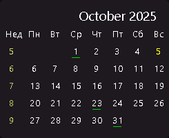

# Календарь для Rainmeter

  

Простой календарь для Rainmeter с поддержкой учебных недель и интеграцией с Obsidian.

---

## Особенности
 
- Автоматический расчёт учебной недели, начинающейся с 1 сентября  
- Индикаторы наличия заметки в Obsidian для каждого дня  
- Клик по дню → открытие или создание `.md`-файла 
- Настраиваемый внешний вид через переменные  
- Совместим с **Rainmeter 4.5+**

---

## Установка

1. Установить:
   - [Rainmeter](https://www.rainmeter.net/)
   - [Obsidian](https://obsidian.md/)

2. Скачать файл `.rmskin` в разделе [Releases](https://github.com/yanexx01/AcademicCalendar/releases)
3. Создать папку "daily-notes" по пути `C:\Users\имя-пользователя\Documents\Obsidian Vault`
4. Открыть файл `.rmskin` и установить плагин
